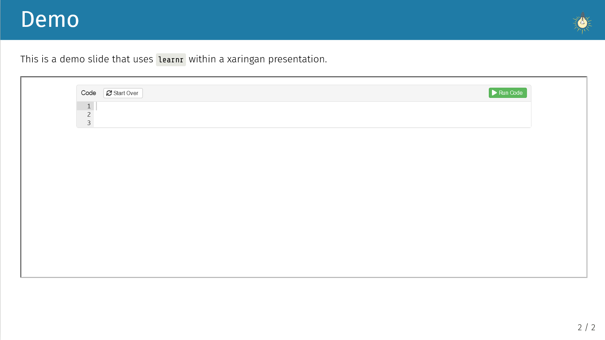

<!-- README.md is generated from README.Rmd. Please edit that file -->

```{r, include = FALSE}
knitr::opts_chunk$set(
  collapse = TRUE,
  comment = "#>",
  out.width = "100%"
)
```

# Xaringan + LearnR

Repo containing basic example using `xaringan` + `learnr app`


```{r, echo = FALSE}
knitr::include_graphics("prtscr/slide1.png")
```

```{r, echo = FALSE}

```